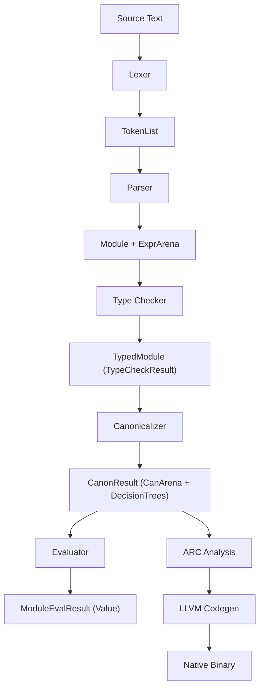
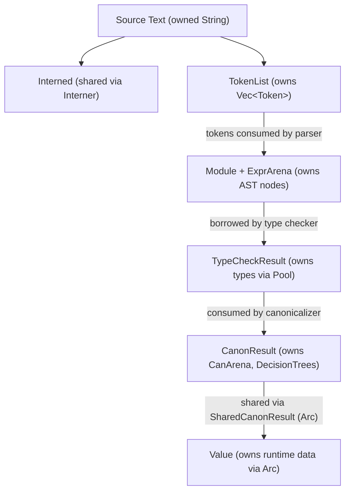

# Data Flow

This document describes how data flows through the Ori compiler, from source text to execution result.

## Overview



## Stage 1: Lexing

**Input**: Source text (String)
**Output**: TokenList

```rust
pub struct TokenList {
    tokens: Vec<Token>,
    spans: Vec<Span>,
}

pub struct Token {
    kind: TokenKind,
    // Identifiers store interned Name
}
```

Data transformations:
1. Character stream -> Token stream
2. Identifiers -> Interned Names (via Interner)
3. Literals -> Typed values (Int, Float, String)
4. Comments -> Discarded (not in token stream)

Example:
```
"let x = 42"

-> TokenList {
     tokens: [
       Token { kind: Let },
       Token { kind: Ident(Name(0)) },  // "x" interned
       Token { kind: Eq },
       Token { kind: Int(42) },
     ],
     spans: [Span(0,3), Span(4,5), Span(6,7), Span(8,10)]
   }
```

## Stage 2: Parsing

**Input**: TokenList
**Output**: ParseOutput { module: Module, arena: ExprArena, errors }

```rust
pub struct Module {
    functions: Vec<Function>,
    types: Vec<TypeDef>,
    tests: Vec<Test>,
    imports: Vec<Import>,
}

pub struct ExprArena {
    exprs: Vec<Expr>,  // Indexed by ExprId
}

pub struct Expr {
    kind: ExprKind,
    span: Span,
}
```

Data transformations:
1. Token stream -> AST nodes
2. Expressions -> Arena-allocated (get ExprId)
3. Syntax errors -> ParseError list

Example:
```
TokenList [Let, Ident(x), Eq, Int(42)]

-> Module {
     functions: [],
     types: [],
     ...
   }

-> ExprArena {
     exprs: [
       Expr { kind: Let { name: x, value: ExprId(1) } },
       Expr { kind: Literal(Int(42)) },
     ]
   }
```

## Stage 3: Type Checking

**Input**: Module + ExprArena
**Output**: TypedModule

```rust
pub struct TypedModule {
    expr_types: Vec<Type>,  // expr_types[expr_id] = type of that expr
    errors: Vec<TypeError>,
}

pub enum Type {
    Int,
    Float,
    Bool,
    Str,
    Char,
    Byte,
    Unit,
    Never,
    Duration,
    Size,
    List(Box<Type>),
    Map { key: Box<Type>, value: Box<Type> },
    Option(Box<Type>),
    Result { ok: Box<Type>, err: Box<Type> },
    Function { params: Vec<Type>, ret: Box<Type> },
    Var(TypeVar),
    Named(Name),
    Applied { name: Name, args: Vec<Type> },
    Error,
    // ...
}
```

Data transformations:
1. Expressions -> Type annotations (stored parallel to ExprArena)
2. Type variables -> Resolved types (via unification)
3. Type mismatches -> TypeError list

Example:
```
ExprArena[ExprId(0)] = Let { name: x, value: ExprId(1) }
ExprArena[ExprId(1)] = Literal(Int(42))

-> TypedModule {
     expr_types: [
       Type::Int,   // ExprId(0) has type Int (from binding)
       Type::Int,   // ExprId(1) has type Int (literal)
     ],
     errors: [],
   }
```

## Stage 3.5: Canonicalization

**Input**: Module + ExprArena + TypeCheckResult + Pool
**Output**: CanonResult

```rust
pub struct CanonResult {
    arena: CanArena,        // Canonical expressions indexed by CanId
    decision_trees: Vec<DecisionTree>,  // Compiled pattern match trees
    constant_pool: ConstantPool,        // Pre-evaluated constants
    roots: Vec<CanonRoot>,  // Named function/test entry points
    // ...
}
```

Data transformations:
1. Named calls -> Positional calls (desugaring)
2. Template literals -> String concatenation
3. Spread expressions -> Method calls
4. Match patterns -> Decision trees (Maranget 2008 algorithm)
5. Compile-time expressions -> Constants (constant folding)
6. Every CanNode annotated with its resolved type

Example:
```
match x {
  Some(n) if n > 0 -> n
  Some(n) -> -n
  None -> 0
}

-> DecisionTree {
     // Compiled into efficient test/switch/bind nodes
     // No redundant checks, optimal ordering
   }
```

This phase runs inside `evaluated()`, not as a separate Salsa query. The `CanonResult` is
wrapped in `SharedCanonResult` (Arc) for sharing across the evaluator and test runner.

## Stage 4: Evaluation

**Input**: CanonResult (canonical IR, not raw AST)
**Output**: ModuleEvalResult

```rust
pub struct ModuleEvalResult {
    value: Value,
    output: EvalOutput,
}

pub enum Value {
    Int(i64),
    Float(f64),
    Bool(bool),
    String(Arc<String>),
    List(Arc<Vec<Value>>),
    Function(FunctionValue),
    // ...
}

pub struct EvalOutput {
    stdout: String,
    stderr: String,
}
```

Data transformations:
1. CanExpr nodes -> Runtime Values (via `eval_can(CanId)`)
2. Decision trees -> Pattern match evaluation
3. Function calls -> Stack frame creation
4. Pattern expressions -> Pattern evaluation
5. Print calls -> Output capture

The evaluator works on canonical IR (`CanExpr`/`CanId`), not raw `ExprKind`/`ExprId`.
This means all desugaring is already done and patterns are pre-compiled into decision trees.

Example:
```
Module with @main() -> int = 42

-> ModuleEvalResult {
     value: Value::Int(42),
     output: EvalOutput { stdout: "", stderr: "" },
   }
```

## Cross-Cutting Data

### Spans

Spans track source locations throughout:

```rust
pub struct Span {
    start: u32,
    end: u32,
}
```

Used in:
- Tokens (where in source)
- Expressions (where in source)
- Errors (where the problem is)
- Code fixes (where to apply fix)

### Interned Names

All identifiers use interned names:

```rust
pub struct Name(u32);

// The Interner maps Name <-> String
interner.intern("foo")  // -> Name(0)
interner.resolve(Name(0))  // -> "foo"
```

Used in:
- Token identifiers
- AST variable names
- Type names
- Pattern names

### Error Types

Each stage has its own error type:

```rust
// Lexer (rare)
pub struct LexError { span: Span, message: String }

// Parser
pub struct ParseError { span: Span, expected: Vec<TokenKind>, found: TokenKind }

// Type checker
pub struct TypeError { span: Span, kind: TypeErrorKind }

// Evaluator
pub struct EvalError { span: Span, kind: EvalErrorKind }
```

All errors carry spans for accurate reporting.

## Memory Flow



Key points:
- No data is copied between stages
- AST is borrowed, not cloned, after parsing
- CanonResult is wrapped in Arc (SharedCanonResult) for sharing across evaluator and test runner
- Values use Arc for safe sharing in closures
- Salsa handles caching and lifetime management
