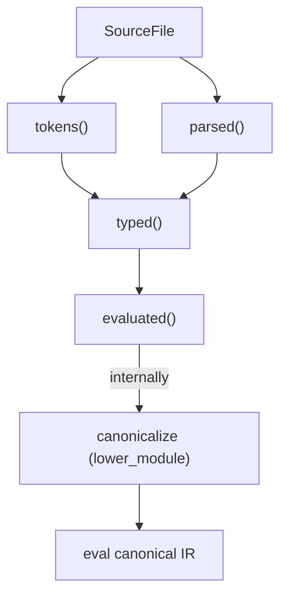

# Compilation Pipeline

The Ori compiler uses a query-based pipeline where each phase is a Salsa query. This design enables incremental compilation and parallel processing.

## Pipeline Stages

### 1. Lexical Analysis (`tokens` query)

**Input**: `SourceFile` (source text)
**Output**: `TokenList`

```rust
#[salsa::tracked]
pub fn tokens(db: &dyn Db, file: SourceFile) -> TokenList
```

The lexer converts source text into tokens:

```
"let x = 42"  ->  [Let, Ident("x"), Eq, Int(42)]
```

Key characteristics:
- Two-layer architecture: raw scanner (`ori_lexer_core`) + token cooking (`ori_lexer`)
- String interning for identifiers
- Handles duration literals (`100ms`), size literals (`4kb`)
- No errors accumulated - invalid input becomes `Error` token

**Intermediate queries**: The `tokens()` query is actually the top of a small query chain:

```
tokens_with_metadata(db, file) → LexOutput  (full lex output including comments/metadata)
    ↓
lex_result(db, file) → LexResult            (tokens + errors, without metadata)
    ↓
tokens(db, file) → TokenList                (just the token list)
lex_errors(db, file) → Vec<LexError>        (just the errors)
```

- `tokens_with_metadata()` calls `lex_with_comments()` and preserves comment/trivia data for the formatter
- `lex_result()` strips metadata from `tokens_with_metadata()` output
- `tokens()` and `lex_errors()` extract their respective fields from `lex_result()`

### 2. Parsing (`parsed` query)

**Input**: `SourceFile` (via `tokens` query)
**Output**: `ParseOutput { module: Module, arena: ExprArena, errors: Vec<ParseError> }`

```rust
#[salsa::tracked]
pub fn parsed(db: &dyn Db, file: SourceFile) -> ParseOutput
```

The parser builds a flat AST using recursive descent:

```
tokens  ->  Module {
              functions: [...],
              types: [...],
              tests: [...],
            }
```

Key characteristics:
- Recursive descent parsing
- Error recovery for better diagnostics
- Arena allocation for expressions
- Accumulates errors (doesn't stop at first error)

### 3. Type Checking (`typed` query)

**Input**: `SourceFile` (via `parsed` query)
**Output**: `TypeCheckResult { typed: TypedModule, error_guarantee: Option<ErrorGuaranteed> }`

```rust
#[salsa::tracked]
pub fn typed(db: &dyn Db, file: SourceFile) -> TypeCheckResult
```

Type checking performs Hindley-Milner inference:

```
parsed AST  ->  TypedModule {
                  expr_types: [Type for each ExprId],
                  errors: [...],
                }
```

Key characteristics:
- Constraint-based inference
- Unification for type variables
- Pattern type checking
- Capability checking

**Side-channel query**: `typed_pool(db, file) -> Option<Arc<Pool>>` provides access to the type `Pool` produced as a side effect of `typed()`. The Pool can't satisfy Salsa's `Clone + Eq + Hash` requirements, so it is stored in a session-scoped `PoolCache` rather than as a Salsa query output. Callers that need the Pool (error rendering, canonicalization, codegen) should call `typed()` first, then `typed_pool()`.

### 4. Canonicalization (independently cached)

**Input**: `ParseOutput` + `TypeCheckResult` + `Pool`
**Output**: `SharedCanonResult` (Arc-wrapped `CanonResult`)

Canonicalization transforms the typed AST into sugar-free canonical IR:

```rust
let shared_canon = canonicalize_cached(db, file, parse_result, type_result, pool);
```

Key operations:
- **Desugaring**: Named calls to positional, template literals to concatenation, spreads to method calls
- **Pattern compilation**: Match patterns to decision trees (Maranget 2008 algorithm)
- **Constant folding**: Compile-time expressions pre-evaluated into `ConstantPool`
- **Type attachment**: Every `CanNode` carries its resolved type

Canonicalization is NOT a Salsa query, but it is independently cached via `canonicalize_cached()` and `canonicalize_cached_by_path()` in the session-scoped `CanonCache`. The `evaluated()` query calls `canonicalize_cached()`, but so do other consumers: the `check` command (for pattern exhaustiveness), the test runner, and the LLVM backend. The cache is keyed by file path and stores `SharedCanonResult` values, so the canonical IR is computed once and shared across all consumers.

### 5. Evaluation (`evaluated` query)

**Input**: `SourceFile` (via `typed` query, then canonicalized)
**Output**: `ModuleEvalResult { value: Value, output: EvalOutput }`

```rust
#[salsa::tracked]
pub fn evaluated(db: &dyn Db, file: SourceFile) -> ModuleEvalResult
```

Tree-walking interpretation over canonical IR:

```
CanonResult  ->  ModuleEvalResult {
                   value: Value::Int(42),
                   output: EvalOutput { stdout, stderr },
                 }
```

Key characteristics:
- Evaluates `CanExpr` nodes (canonical IR), not raw `ExprKind`
- Stack-based environment
- Decision tree evaluation for pattern matching
- Pattern registry for execution
- Module caching for imports
- Parallel test execution

## Query Dependencies



When `SourceFile` changes:
1. `tokens()` re-runs
2. If tokens unchanged, `parsed()` uses cached result (early cutoff)
3. If parsed unchanged, `typed()` uses cached result
4. If typed unchanged, `evaluated()` uses cached result

### 6. Pattern Checking (inside `check` command)

Canonicalization also runs in the `check` command — independently of `evaluated()` — to detect pattern problems before execution:

```rust
let canon_result = ori_canon::lower_module(
    &parse_result.module,
    &parse_result.arena,
    &type_result,
    &pool,
    interner,
);
for problem in &canon_result.problems {
    let diag = pattern_problem_to_diagnostic(problem, interner);
    emitter.emit(&diag);
}
```

This detects non-exhaustive matches and redundant arms at check time, without running the evaluator.

## Phase Characteristics

| Phase | Errors | Recovery | Output |
|-------|--------|----------|--------|
| Lexer | Rare (invalid chars) | Continue | TokenList |
| Parser | Syntax errors | Skip/recover | Module + errors |
| Typeck | Type mismatches | Continue | Types + errors |
| Canon | Pattern problems | Accumulate | CanonResult + PatternProblems |
| Eval | Runtime errors | Stop | Value or error |

## Error Accumulation

The pipeline accumulates errors rather than stopping:

```rust
// Parser accumulates errors
let result = parser.parse();
// result.errors may contain multiple errors

// Type checker accumulates errors
let typed = type_check(&result);
// typed.errors may contain multiple errors

// Only evaluation stops on first error
let value = evaluate(&typed)?;
```

This provides users with comprehensive diagnostics in one pass.

## Salsa Event Logging

For debugging, the pipeline logs Salsa query events via tracing:

```
ORI_LOG=oric=debug ori check file.ori
```

Output shows query execution:
```
DEBUG oric: will_execute: tokens(file_0)
DEBUG oric: did_execute: tokens(file_0) in 1.2ms
DEBUG oric: will_execute: parsed(file_0)
DEBUG oric: did_execute: parsed(file_0) in 3.4ms
```

Other useful tracing targets:
```
ORI_LOG=ori_types=trace ORI_LOG_TREE=1 ori check file.ori  # Type inference tree
ORI_LOG=ori_eval=debug ori run file.ori                    # Evaluator dispatch
```
