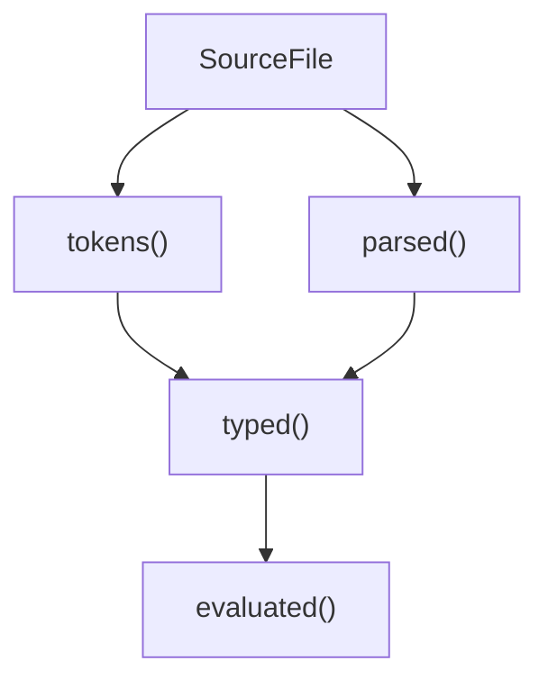

# Compilation Pipeline

The Ori compiler uses a query-based pipeline where each phase is a Salsa query. This design enables incremental compilation and parallel processing.

## Pipeline Stages

### 1. Lexical Analysis (`tokens` query)

**Input**: `SourceFile` (source text)
**Output**: `TokenList`

```rust
#[salsa::tracked]
pub fn tokens(db: &dyn Db, file: SourceFile) -> TokenList
```

The lexer (built on logos) converts source text into tokens:

```
"let x = 42"  ->  [Let, Ident("x"), Eq, Int(42)]
```

Key characteristics:
- DFA-based tokenization via logos crate
- String interning for identifiers
- Handles duration literals (`100ms`), size literals (`4kb`)
- No errors accumulated - invalid input becomes `Error` token

### 2. Parsing (`parsed` query)

**Input**: `SourceFile` (via `tokens` query)
**Output**: `ParseResult { module: Module, arena: ExprArena, errors: Vec<ParseError> }`

```rust
#[salsa::tracked]
pub fn parsed(db: &dyn Db, file: SourceFile) -> ParseResult
```

The parser builds a flat AST using recursive descent:

```
tokens  ->  Module {
              functions: [...],
              types: [...],
              tests: [...],
            }
```

Key characteristics:
- Recursive descent parsing
- Error recovery for better diagnostics
- Arena allocation for expressions
- Accumulates errors (doesn't stop at first error)

### 3. Type Checking (`typed` query)

**Input**: `SourceFile` (via `parsed` query)
**Output**: `TypedModule { expr_types: Vec<Type>, errors: Vec<TypeError> }`

```rust
#[salsa::tracked]
pub fn typed(db: &dyn Db, file: SourceFile) -> TypedModule
```

Type checking performs Hindley-Milner inference:

```
parsed AST  ->  TypedModule {
                  expr_types: [Type for each ExprId],
                  errors: [...],
                }
```

Key characteristics:
- Constraint-based inference
- Unification for type variables
- Pattern type checking
- Capability checking

### 4. Evaluation (`evaluated` query)

**Input**: `SourceFile` (via `typed` query)
**Output**: `ModuleEvalResult { value: Value, output: EvalOutput }`

```rust
#[salsa::tracked]
pub fn evaluated(db: &dyn Db, file: SourceFile) -> ModuleEvalResult
```

Tree-walking interpretation:

```
typed AST  ->  ModuleEvalResult {
                 value: Value::Int(42),
                 output: EvalOutput { stdout, stderr },
               }
```

Key characteristics:
- Stack-based environment
- Pattern registry for execution
- Module caching for imports
- Parallel test execution

## Query Dependencies



When `SourceFile` changes:
1. `tokens()` re-runs
2. If tokens unchanged, `parsed()` uses cached result (early cutoff)
3. If parsed unchanged, `typed()` uses cached result
4. If typed unchanged, `evaluated()` uses cached result

## Phase Characteristics

| Phase | Errors | Recovery | Output |
|-------|--------|----------|--------|
| Lexer | Rare (invalid chars) | Continue | TokenList |
| Parser | Syntax errors | Skip/recover | Module + errors |
| Typeck | Type mismatches | Continue | Types + errors |
| Eval | Runtime errors | Stop | Value or error |

## Error Accumulation

The pipeline accumulates errors rather than stopping:

```rust
// Parser accumulates errors
let result = parser.parse();
// result.errors may contain multiple errors

// Type checker accumulates errors
let typed = type_check(&result);
// typed.errors may contain multiple errors

// Only evaluation stops on first error
let value = evaluate(&typed)?;
```

This provides users with comprehensive diagnostics in one pass.

## Salsa Event Logging

For debugging, the pipeline logs Salsa events:

```
ORI_DEBUG=salsa cargo run
```

Output shows query execution:
```
[Salsa] will_execute: tokens(file_0)
[Salsa] did_execute: tokens(file_0) in 1.2ms
[Salsa] will_execute: parsed(file_0)
[Salsa] did_execute: parsed(file_0) in 3.4ms
```
