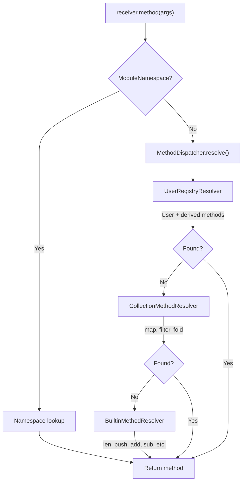

# Evaluator Overview

The Ori evaluator is a tree-walking interpreter that executes canonical IR. All evaluation goes through `eval_can(CanId)` in `can_eval.rs`, where `CanExpr` is the sole evaluation representation. The evaluator handles expression evaluation, function calls, decision-tree pattern matching, and module loading.

## Architecture

The evaluator is split between two crates:

- **`ori_eval`** - Core interpreter logic (reusable, no Salsa dependency)
- **`oric/src/eval/`** - High-level orchestration (module loading, prelude, Salsa integration)

## Location

### Core Interpreter (`ori_eval`)

```
compiler/ori_eval/src/
├── lib.rs                    # Module exports, re-exports from ori_patterns
├── module_registration.rs    # Salsa-free module registration (impl, extend, constructors)
├── environment.rs            # Environment, Scope, LocalScope
├── errors.rs                 # EvalError factory functions
├── eval_mode.rs              # EvalMode (Interpret/TestRun/ConstEval), ModeState
├── diagnostics.rs            # CallStack, CallFrame, EvalBacktrace, EvalCounters
├── operators.rs              # Binary operator dispatch
├── unary_operators.rs        # Unary operator dispatch
├── function_val.rs           # Type conversions (int, float, str, byte)
├── user_methods.rs           # UserMethodRegistry for user-defined methods
├── print_handler.rs          # Print output capture (stdout/buffer handlers)
├── shared.rs                 # SharedRegistry, SharedMutableRegistry
├── method_key.rs             # MethodKey newtype
├── methods/                  # Built-in method dispatch (split by domain)
│   ├── mod.rs                    # EVAL_BUILTIN_METHODS constant, BuiltinMethodNames
│   ├── collections.rs            # List, map, set, tuple, range methods
│   ├── compare.rs                # Comparison and equality methods
│   ├── helpers.rs                # Shared iterator helpers (map, filter, fold, etc.)
│   ├── numeric.rs                # Int, float, byte arithmetic and conversion
│   ├── ordering.rs               # Ordering type methods
│   ├── units.rs                  # Duration and Size methods
│   └── variants.rs               # Option, Result, Variant methods
├── exec/                     # Expression execution utilities
│   ├── mod.rs                    # Module exports
│   ├── expr.rs                   # Identifiers, indexing, field access, ranges
│   ├── call.rs                   # Function call evaluation, argument binding
│   ├── control.rs                # Pattern matching, loop actions, assignment
│   └── decision_tree.rs          # Decision tree evaluation for multi-clause functions
└── interpreter/              # Core interpreter
    ├── mod.rs                    # Interpreter struct, pre-interned name caches
    ├── builder.rs                # InterpreterBuilder
    ├── can_eval.rs               # eval_can(CanId) — canonical IR evaluation dispatch
    ├── scope_guard.rs            # RAII scope management
    ├── function_call.rs          # User function calls
    ├── method_dispatch.rs        # Method resolution, iterator helpers
    ├── derived_methods.rs        # Derived trait method evaluation
    └── resolvers/                # Method resolution chain
        ├── mod.rs                    # MethodDispatcher, MethodResolver trait
        ├── user_registry.rs          # UserRegistryResolver (user + derived)
        ├── collection.rs             # CollectionMethodResolver (map, filter, fold)
        └── builtin.rs                # BuiltinMethodResolver
```

### High-Level Evaluator (`oric/src/eval/`)

```
compiler/oric/src/eval/
├── mod.rs                    # Re-exports, value module alias
├── output.rs                 # EvalOutput, ModuleEvalResult
├── evaluator/                # Evaluator wrapper
│   ├── mod.rs                    # Evaluator struct (wraps Interpreter)
│   ├── builder.rs                # EvaluatorBuilder
│   ├── module_loading.rs         # load_module, load_prelude, method collection
│   └── tests.rs                  # Unit tests
└── module/                   # Import resolution
    ├── mod.rs                    # Module exports
    └── import.rs                 # Module import handling
```

## Design Goals

1. **Correctness** - Match language specification exactly
2. **Clear error messages** - Track source locations, provide context
3. **Modularity** - Separate concerns into focused modules
4. **Testability** - Dependency injection for registries

## Evaluation Flow

```
TypedModule { Module, ExprArena, expr_types }
    │
    │ canonicalize → CanonResult (CanExpr arena)
    ▼
Evaluator {
    interpreter: Interpreter,  // Core eval engine
    db: &dyn Db,               // Salsa database
    prelude_loaded: bool,      // Auto-load guard
}
    │
    │ find and call @main (or evaluate top-level)
    │ all evaluation via eval_can(CanId)
    ▼
ModuleEvalResult {
    value: Value,              // Final result
    output: EvalOutput,        // Captured stdout/stderr
}
```

## Core Components

### Interpreter (core, `ori_eval`)

The core tree-walking interpreter, portable and reusable without Salsa. All evaluation
goes through `eval_can(CanId)` in `can_eval.rs`, dispatching on canonical IR (`CanExpr`):

```rust
pub struct Interpreter<'a> {
    /// String interner for name lookup.
    interner: &'a StringInterner,
    /// Expression arena.
    arena: &'a ExprArena,
    /// Current environment.
    env: Environment,
    /// Pre-computed Name for "self" keyword (avoids repeated interning).
    self_name: Name,
    /// Pre-interned type names for hot-path method dispatch.
    type_names: TypeNames,
    /// Pre-interned print method names for eval_method_call print dispatch.
    print_names: PrintNames,
    /// Pre-interned FunctionExp property names for prop dispatch.
    prop_names: PropNames,
    /// Pre-interned operator trait method names for user-defined operator dispatch.
    op_names: OpNames,
    /// Pre-interned format-related names for `FormatSpec` value construction.
    format_names: FormatNames,
    /// Pre-interned builtin method names for Name-based dispatch.
    builtin_method_names: BuiltinMethodNames,
    /// Evaluation mode — determines I/O, recursion, budget policies.
    mode: EvalMode,
    /// Per-mode mutable state (budget counters, profiling).
    mode_state: ModeState,
    /// Live call stack for recursion tracking and backtrace capture.
    call_stack: CallStack,
    /// User-defined method registry for impl block methods.
    user_method_registry: SharedMutableRegistry<UserMethodRegistry>,
    /// Cached method dispatcher for efficient method resolution.
    method_dispatcher: resolvers::MethodDispatcher,
    /// Shared arena for imported functions and lambda capture.
    imported_arena: SharedArena,
    /// Print handler for the Print capability.
    print_handler: SharedPrintHandler,
    /// Scope ownership for RAII-style panic-safe scope cleanup.
    scope_ownership: ScopeOwnership,
    /// Source file path for Traceable trace entries.
    source_file_path: Option<Arc<String>>,
    /// Source text for line/column computation in trace entries.
    source_text: Option<Arc<String>>,
    /// Canonical IR for the current module.
    canon: Option<SharedCanonResult>,
}
```

Key design features:
- **Pre-interned names**: `TypeNames`, `PrintNames`, `PropNames`, `OpNames`, `FormatNames`, and `BuiltinMethodNames` are pre-interned at construction for `u32 == u32` comparison instead of string lookup in hot paths
- **EvalMode**: Parameterizes behavior for `ori run` (Interpret), `ori test` (TestRun), and compile-time evaluation (ConstEval)
- **CallStack**: Proper frame tracking replacing the old `call_depth: usize`, with backtrace capture at error sites
- **ScopeOwnership**: RAII Drop-based scope cleanup for panic safety

### Evaluator (high-level, `oric`)

The high-level evaluator wraps `Interpreter` and adds module loading and Salsa integration:

```rust
pub struct Evaluator<'a> {
    /// Core interpreter (restricted to module tree).
    pub(super) interpreter: Interpreter<'a>,
    /// Database reference for Salsa-tracked file loading.
    db: &'a dyn Db,
    /// Whether the prelude has been auto-loaded.
    prelude_loaded: bool,
}
```

### Why `SharedMutableRegistry`?

The `MethodDispatcher` is constructed once in `InterpreterBuilder` with references to
the `UserMethodRegistry`. However, `load_module()` needs to register new methods
(from impl blocks, extends, and derives) after the Interpreter is created.

Using `SharedMutableRegistry<T>` (which wraps `Arc<RwLock<T>>`) allows:
1. The cached `MethodDispatcher` to see newly registered methods
2. Efficient read access during method resolution (no rebuilding)
3. Thread-safe method registration during module loading

```rust
// In load_module():
self.interpreter.user_method_registry.write().merge(new_methods);

// In method resolution (via MethodDispatcher):
if let Some(method) = self.registry.read().lookup(type_name, method_name) { ... }
```

### Evaluation Entry Point

```rust
impl Evaluator {
    pub fn evaluate(&mut self, module: &Module) -> Result<Value, EvalError> {
        // Register module-level items
        self.register_functions(module)?;
        self.register_types(module)?;

        // Find and call @main — dispatches through eval_can(CanId)
        if let Some(main_fn) = module.find_function("main") {
            self.call_function(main_fn, vec![])
        } else {
            // No main - evaluate top-level expression
            self.eval_module_expression(module)
        }
    }
}
```

All expression evaluation dispatches through `eval_can(CanId)` in `interpreter/can_eval.rs`,
which reads from the canonical IR (`SharedCanonResult`) rather than the `ExprArena` directly.

## Key Features

### Value System

Runtime values with `Heap<T>` for Arc-based sharing:

```rust
pub enum Value {
    // Primitives (inline)
    Int(ScalarInt),               // Newtype over i64, checked arithmetic
    Float(f64),
    Bool(bool),
    Char(char),
    Byte(u8),
    Void,                         // Unit type
    Duration(i64),                // Nanoseconds
    Size(u64),                    // Bytes
    Ordering(OrderingValue),      // Custom enum (Less/Equal/Greater)

    // Heap types
    Str(Heap<Cow<'static, str>>), // Cow for zero-copy interned strings
    List(Heap<Vec<Value>>),
    Map(Heap<BTreeMap<Value, Value>>),  // BTreeMap for deterministic iteration
    Set(Heap<BTreeMap<Value, ()>>),     // BTreeMap (NOT HashSet) for deterministic order
    Tuple(Heap<Vec<Value>>),
    Range(Heap<RangeValue>),

    // Algebraic (split variants, NOT Option/Result wrappers)
    Some(Heap<Value>),
    None,
    Ok(Heap<Value>),
    Err(Heap<Value>),

    // User-defined types
    Struct(StructValue),
    Variant { type_name: Name, variant_name: Name, fields: Heap<Vec<Value>> },
    VariantConstructor { type_name: Name, variant_name: Name, field_count: usize },
    Newtype { type_name: Name, inner: Heap<Value> },
    NewtypeConstructor { type_name: Name },

    // Callables
    Function(FunctionValue),
    MemoizedFunction(MemoizedFunctionValue),
    FunctionVal(FunctionValFn, &'static str),  // Built-in type conversions

    // Other
    Iterator(IteratorValue),
    ModuleNamespace(Heap<BTreeMap<Name, Value>>),  // BTreeMap for Salsa compatibility
    Error(Heap<ErrorValue>),
    TypeRef { type_name: Name },  // For associated function calls
}
```

The `Heap<T>` wrapper enforces Arc allocation for shared values:

```rust
/// Wrapper for heap-allocated values using Arc.
/// Ensures all heap values go through factory methods.
#[repr(transparent)]
pub struct Heap<T>(Arc<T>);
```

**Key design choice:** `Map` and `ModuleNamespace` use `BTreeMap` for deterministic iteration order, which is required for Salsa compatibility and consistent test output.

### ModuleNamespace Values

The `ModuleNamespace` variant represents module aliases at runtime. It stores a map of exported names to their values (typically `FunctionValue`s), enabling qualified access:

```rust
// Ori source
use std.math as math
math.sqrt(x: 16.0)

// Runtime: math is bound to Value::ModuleNamespace containing sqrt
Value::ModuleNamespace(Heap::new(BTreeMap::from([
    (intern("sqrt"), Value::Function(...)),
    (intern("abs"), Value::Function(...)),
    // ... other exports
])))
```

When a method call occurs on a `ModuleNamespace` value, the interpreter intercepts it before normal method dispatch and looks up the function directly in the namespace map.

### Environment

Stack-based lexical scoping with parent-linked scopes:

```rust
/// Scope with parent chain for lexical scoping.
pub struct Scope {
    bindings: FxHashMap<Name, Binding>,  // Fast hash for Name keys
    parent: Option<LocalScope<Scope>>,    // Rc<RefCell<Scope>>
}

/// Environment with scope stack.
pub struct Environment {
    scopes: Vec<LocalScope<Scope>>,
    global: LocalScope<Scope>,
}
```

The `LocalScope<T>` wrapper is `Rc<RefCell<T>>` for single-threaded scope management:
- More efficient than `Arc<RwLock<T>>` for single-threaded use
- Parent chain enables closure capture
- `FxHashMap` provides faster hashing for `Name` keys

```rust
let x = 1;          // Outer scope: x = 1
{
    let x = 2;      // Inner scope: x = 2
    x + outer_x     // Can't access outer x directly
}
// x = 1 again
```

### RAII Scope Guards

The evaluator uses RAII-style scope guards for panic-safe scope management. Both `ori_eval::Interpreter` and `oric::Evaluator` provide identical APIs through `ScopedInterpreter` and `ScopedEvaluator` guards respectively.

```rust
// Direct guard usage (most flexible)
{
    let mut scoped = interpreter.scoped();  // or evaluator.scoped()
    scoped.env.define(name, value, Mutability::Immutable);
    scoped.eval(body)?;
} // pop_scope called here, even on panic

// Closure-based convenience methods
self.with_env_scope(|scoped| {
    scoped.env.define(name, value, Mutability::Immutable);
    scoped.eval(body)
})

// Execute with pre-defined bindings
self.with_bindings(bindings, |scoped| scoped.eval(body))

// Execute with match bindings (immutable)
self.with_match_bindings(pattern_bindings, |scoped| scoped.eval(arm_body))

// Execute with a single binding
self.with_binding(name, value, Mutability::Immutable, |scoped| scoped.eval(body))
```

The guards implement `Deref` and `DerefMut` to the underlying interpreter/evaluator, allowing transparent access to all methods. Cleanup is guaranteed even on panic via the `Drop` implementation.

### Canonical IR Evaluation

All evaluation goes through `eval_can(CanId)` in `interpreter/can_eval.rs`. The canonical IR
(`CanExpr`) is a sugar-free representation — spread operators, template strings, named arguments,
and other syntactic sugar are desugared during canonicalization. This means `eval_can` only handles
core expression forms:

```rust
impl Interpreter<'_> {
    /// Entry point for canonical expression evaluation with stack safety.
    pub fn eval_can(&mut self, can_id: CanId) -> EvalResult {
        ensure_sufficient_stack(|| self.eval_can_inner(can_id))
    }
}
```

The `CanExpr` type is `Copy` (24 bytes), so the kind is copied out of the arena before dispatching.
This releases the immutable borrow on `self.canon`, allowing recursive `self.eval_can()` calls.

Pattern matching uses decision tree evaluation via `exec/decision_tree.rs`, operating on canonical IR
rather than the deleted `exec/pattern.rs`.

### EvalMode

The interpreter's behavior is parameterized by `EvalMode` (defined in `eval_mode.rs`):

| Mode | Purpose | I/O | Recursion Limit | Budget |
|------|---------|-----|-----------------|--------|
| **Interpret** | `ori run` | Full | None (native) / 200 (WASM) | None |
| **TestRun** | `ori test` | Buffered capture | 500 | None |
| **ConstEval** | Compile-time eval | Forbidden | 64 | Configurable call limit |

`ModeState` tracks per-mode mutable state: call budget for `ConstEval`, optional performance
counters activated by `--profile`. Counter increments are inlined no-ops when profiling is off.

### CallStack

The `CallStack` (defined in `diagnostics.rs`) replaces the old `call_depth: usize` with proper
frame tracking:

```rust
pub struct CallFrame {
    pub name: Name,                  // Interned function/method name
    pub call_span: Option<Span>,     // Source location of the call site
}

pub struct CallStack {
    frames: Vec<CallFrame>,
    max_depth: Option<usize>,        // None for unlimited (native Interpret mode)
}
```

- **Depth checking**: Integrated into `push()` — returns `Err(StackOverflow)` if limit exceeded
- **Backtrace capture**: `capture()` snapshots frames into `EvalBacktrace` for error diagnostics
- **Clone-per-child**: When creating a child interpreter for a function call, the stack is cloned.
  This is O(N) per call (~24 bytes per frame, ~24 KiB at 1000 depth)

## Cross-Crate Method Consistency

The evaluator exports an `EVAL_BUILTIN_METHODS` constant listing all `(type_name, method_name)` pairs it handles. The type checker exports a corresponding `TYPECK_BUILTIN_METHODS` constant. A consistency test in `oric/src/eval/tests/methods_tests.rs` verifies:

1. Every eval method is a subset of typeck methods (no runtime-only methods that the type checker doesn't know about)
2. Both lists are sorted for maintainability

Known exceptions (methods in eval but not yet in typeck) are tracked in a `KNOWN_EVAL_ONLY` list. This includes operator methods (`add`, `sub`, `mul`, etc.) which the evaluator dispatches through the method system but the type checker handles via trait lookup rather than builtin handlers.

## Method Dispatch Architecture

The evaluator uses a Chain of Responsibility pattern for method resolution:



### Operator Dispatch

Binary and unary operators are dispatched uniformly through the method system. The interpreter converts operators to method calls:

| Operator | Method | Trait |
|----------|--------|-------|
| `+` | `add` | `Add` |
| `-` | `sub` | `Sub` |
| `*` | `mul` | `Mul` |
| `/` | `div` | `Div` |
| `%` | `rem` | `Rem` |
| `div` | `floor_div` | `FloorDiv` |
| `&` | `bit_and` | `BitAnd` |
| `\|` | `bit_or` | `BitOr` |
| `^` | `bit_xor` | `BitXor` |
| `<<` | `shl` | `Shl` |
| `>>` | `shr` | `Shr` |
| `-x` | `neg` | `Neg` |
| `!x` | `not` | `Not` |
| `~x` | `bit_not` | `BitNot` |

```rust
// In interpreter/mod.rs
fn eval_binary(&mut self, left: ExprId, op: BinaryOp, right: ExprId) -> EvalResult {
    // Short-circuit for && and ||
    if op == BinaryOp::And || op == BinaryOp::Or { ... }

    // Comparison operators use direct evaluation
    if matches!(op, BinaryOp::Eq | BinaryOp::Ne | BinaryOp::Lt | ...) { ... }

    let left_val = self.eval(left)?;
    let right_val = self.eval(right)?;

    // Mixed-type operations fall back to direct evaluation
    if is_mixed_primitive_op(op, &left_val, &right_val) {
        return eval_binary_op(&left_val, op, &right_val, self.interner);
    }

    // Dispatch through method system
    if let Some(method_name) = binary_op_to_method(op) {
        return self.call_method(&left_val, method_name, &[right_val]);
    }

    eval_binary_op(&left_val, op, &right_val, self.interner)
}
```

**Mixed-Type Operations**: Certain operations like `int * Duration` or `int * Size` have the primitive on the left side. Since primitives don't implement trait methods with `Self` receiver, these fall back to direct evaluation:

```rust
fn is_mixed_primitive_op(op: BinaryOp, left: &Value, right: &Value) -> bool {
    matches!(
        (op, left, right),
        (BinaryOp::Mul, Value::Int(_), Value::Duration(_) | Value::Size(_))
    )
}
```

### ModuleNamespace Special Case

Method calls on `ModuleNamespace` values bypass the normal method dispatch chain. The interpreter checks for `ModuleNamespace` receivers early in method call evaluation and performs a direct lookup in the namespace's function map:

```rust
// In interpreter/mod.rs - MethodCall handling
if let Value::ModuleNamespace(ns) = &receiver {
    let func = ns.get(method_name).ok_or_else(|| {
        no_member_in_module(method_name)
    })?;
    return self.eval_call(func.clone(), &args);
}
// Otherwise, proceed with normal method dispatch
```

This ensures qualified access like `math.add(a: 1, b: 2)` resolves to the correct function without attempting to find an `add` method on a "module" type.

The `UserRegistryResolver` is a unified resolver that checks both user-defined methods
(from impl blocks) and derived methods (from `#[derive(...)]`) in a single lookup.

### Iterator Helpers

Collection methods share logic via internal iterator helpers:

```rust
// Shared iterator-based implementations
fn map_iterator(&mut self, iter: impl Iterator<Item=Value>, transform: &Value) -> EvalResult
fn filter_iterator(&mut self, iter: impl Iterator<Item=Value>, predicate: &Value) -> EvalResult
fn fold_iterator(&mut self, iter: impl Iterator<Item=Value>, acc: Value, op: &Value) -> EvalResult
fn find_in_iterator(&mut self, iter: impl Iterator<Item=Value>, predicate: &Value) -> EvalResult
fn any_in_iterator(&mut self, iter: impl Iterator<Item=Value>, predicate: &Value) -> EvalResult
fn all_in_iterator(&mut self, iter: impl Iterator<Item=Value>, predicate: &Value) -> EvalResult

// Used by both list and range methods:
fn eval_list_map(&mut self, items: &[Value], args: &[Value]) -> EvalResult {
    self.map_iterator(items.iter().cloned(), &args[0])
}

fn eval_range_map(&mut self, range: &RangeValue, args: &[Value]) -> EvalResult {
    self.map_iterator(range.iter().map(Value::Int), &args[0])
}
```

### Type Name Resolution

The `get_value_type_name()` method uses the `StringLookup` trait for unified type name resolution:

```rust
pub(super) fn get_value_type_name(&self, value: &Value) -> String {
    value.type_name_with_interner(self.interner).into_owned()
}
```

This handles struct type names (which require interner lookup) while delegating
to `Value::type_name()` for primitives and built-in types.

## Builder Pattern

Both `Interpreter` and `Evaluator` use the builder pattern for construction.

### InterpreterBuilder (core, `ori_eval`)

```rust
let interpreter = InterpreterBuilder::new(interner, arena)
    .env(call_env)                          // Optional: custom environment
    .imported_arena(shared_arena)           // Optional: cross-module arena
    .user_method_registry(registry)         // Optional: user methods
    .print_handler(handler)                 // Optional: output handler
    .build();
```

### EvaluatorBuilder (high-level, `oric`)

```rust
let evaluator = EvaluatorBuilder::new(interner, arena)
    .env(call_env)
    .imported_arena(shared_arena)
    .user_method_registry(registry)
    .build();  // Creates Evaluator wrapping Interpreter
```

Benefits:
- Single entry point for all configuration options
- Clearer intent—named methods describe what each option does
- Easier to add new configuration options without API changes
- Defaults work for common cases; override only what you need

## Arena Threading Pattern

When evaluating functions or methods from different modules, the interpreter must
use the correct arena for expression lookups. Each `FunctionValue` carries its own
`SharedArena` (the arena from the module where it was defined). The `create_function_interpreter`
helper ensures this:

```rust
/// Create a new interpreter for function/method evaluation with the correct arena.
///
/// This is critical for cross-module calls: functions from imported modules
/// carry their own SharedArena, and we must use that arena when evaluating
/// their body expressions.
pub(super) fn create_function_interpreter<'b>(
    &self,
    func_arena: &'b ExprArena,
    call_env: Environment,
) -> Interpreter<'b>
where
    'a: 'b,
{
    let imported_arena = SharedArena::new(func_arena.clone());
    InterpreterBuilder::new(self.interner, func_arena)
        .env(call_env)
        .imported_arena(imported_arena)
        .user_method_registry(self.user_method_registry.clone())
        .build()
}
```

This pattern appears in `ori_eval/src/interpreter/`:
- `function_call.rs` - calling user functions
- `method_dispatch.rs` - calling user methods

### Why Arena Threading Matters

Consider a scenario where module A imports a function from module B:

```
Module A (arena_a)          Module B (arena_b)
┌──────────────────┐        ┌──────────────────┐
│ @main () = {     │        │ @helper (x: int) │
│   helper(42)     │ ──────►│   = x * 2        │
│ }                │        │                  │
└──────────────────┘        └──────────────────┘
```

When `main` calls `helper`, the interpreter must switch from `arena_a` to `arena_b`
to look up the expression `x * 2`. The `FunctionValue` stores a `SharedArena`
reference to `arena_b`, and `create_function_interpreter` creates a child interpreter
using that arena.

**Key invariant**: An `ExprId` is only valid within its originating arena. Mixing
arenas causes undefined behavior (wrong expression lookups)

## Module Registration (Salsa-Free)

The `ori_eval` crate provides standalone module registration functions that work without
Salsa dependencies. This enables any client (CLI, WASM playground, embedded interpreters)
to use the full Ori interpreter.

### Architecture

```
┌─────────────────────────────────────────────────────────┐
│                     ori_eval                            │
│  (Salsa-free, fully standalone)                        │
│                                                         │
│  module_registration.rs:                               │
│    - register_module_functions()                        │
│    - collect_impl_methods()                            │
│    - collect_extend_methods()                          │
│    - register_variant_constructors()                   │
│    - register_newtype_constructors()                   │
└─────────────────────────────────────────────────────────┘
              ▲                           ▲
              │                           │
    ┌─────────┴─────────┐       ┌────────┴────────┐
    │       oric        │       │  Any Client     │
    │  (Salsa queries,  │       │  (WASM, embed,  │
    │   file loading)   │       │   tests, etc.)  │
    └───────────────────┘       └─────────────────┘
```

### Registration Functions

All functions are pure and take explicit parameters (no `&self` from Evaluator):

```rust
/// Register all functions from a module into the environment.
pub fn register_module_functions(
    module: &Module,
    arena: &SharedArena,
    env: &mut Environment,
    canon: Option<&SharedCanonResult>,
);

/// Collect methods from impl blocks into a registry.
pub fn collect_impl_methods(
    module: &Module,
    arena: &SharedArena,
    captures: &HashMap<Name, Value>,
    registry: &mut UserMethodRegistry,
);

/// Collect methods from extend blocks into a registry.
pub fn collect_extend_methods(
    module: &Module,
    arena: &SharedArena,
    captures: &HashMap<Name, Value>,
    registry: &mut UserMethodRegistry,
);

/// Register variant constructors from sum type declarations.
pub fn register_variant_constructors(module: &Module, env: &mut Environment);

/// Register newtype constructors from type declarations.
pub fn register_newtype_constructors(module: &Module, env: &mut Environment);
```

### Usage in oric (Salsa-based)

The `oric` crate handles Salsa-tracked file loading and parsing, then delegates
to these functions:

```rust
// In oric/src/eval/evaluator/module_loading.rs
pub fn load_module(
    &mut self,
    parse_result: &ParseOutput,
    file_path: &Path,
    canon: Option<&SharedCanonResult>,
) -> Result<(), String> {
    // ... resolve imports via Salsa ...

    let shared_arena = SharedArena::new(parse_result.arena.clone());

    // Delegate to ori_eval for registration
    register_module_functions(&parse_result.module, &shared_arena, self.env_mut());
    register_variant_constructors(&parse_result.module, self.env_mut());
    register_newtype_constructors(&parse_result.module, self.env_mut());

    // Build user method registry
    let mut user_methods = UserMethodRegistry::new();
    let captures = self.env().capture();
    collect_impl_methods(&parse_result.module, &shared_arena, &captures, &mut user_methods);
    collect_extend_methods(&parse_result.module, &shared_arena, &captures, &mut user_methods);

    // Process derives and merge
    process_derives(&parse_result.module, &type_registry, &mut user_methods, self.interner());
    self.user_method_registry().write().merge(user_methods);

    Ok(())
}
```

### Usage in WASM Playground

The WASM playground uses the same functions without any Salsa dependency:

```rust
// In playground/wasm/src/lib.rs
fn run_ori_internal(source: &str) -> RunResult {
    // ... parse and type check ...

    let shared_arena = SharedArena::new(parse_result.arena.clone());

    // Build user method registry
    let mut user_methods = UserMethodRegistry::new();
    let captures = interpreter.env().capture();
    collect_impl_methods(&parse_result.module, &shared_arena, &captures, &mut user_methods);
    collect_extend_methods(&parse_result.module, &shared_arena, &captures, &mut user_methods);

    // Process derives
    process_derives(&parse_result.module, &type_registry, &mut user_methods, &interner);

    // Merge into interpreter
    interpreter.user_method_registry.write().merge(user_methods);

    // Register functions and constructors
    register_module_functions(&parse_result.module, &shared_arena, interpreter.env_mut());
    register_variant_constructors(&parse_result.module, interpreter.env_mut());
    register_newtype_constructors(&parse_result.module, interpreter.env_mut());

    // ... execute @main ...
}
```

## Related Documents

- [Tree Walking](tree-walking.md) - Execution strategy
- [Environment](environment.md) - Variable scoping
- [Value System](value-system.md) - Runtime values
- [Module Loading](module-loading.md) - Import resolution
