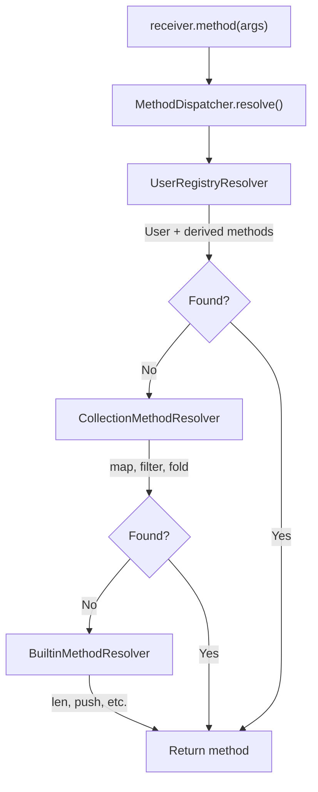

# Evaluator Overview

The Ori evaluator is a tree-walking interpreter that executes typed ASTs. It handles expression evaluation, function calls, pattern execution, and module loading.

## Architecture

The evaluator is split between two crates:

- **`ori_eval`** - Core interpreter logic (reusable, no Salsa dependency)
- **`oric/src/eval/`** - High-level orchestration (module loading, prelude, Salsa integration)

## Location

### Core Interpreter (`ori_eval`)

```
compiler/ori_eval/src/
├── lib.rs                    # Module exports, re-exports from ori_patterns
├── environment.rs            # Environment, Scope, LocalScope
├── errors.rs                 # EvalError factory functions
├── operators.rs              # Binary operator dispatch
├── unary_operators.rs        # Unary operator dispatch
├── methods.rs                # Built-in method dispatch, EVAL_BUILTIN_METHODS constant
├── function_val.rs           # Type conversions (int, float, str, byte)
├── user_methods.rs           # UserMethodRegistry for user-defined methods
├── print_handler.rs          # Print output capture (stdout/buffer handlers)
├── shared.rs                 # SharedRegistry, SharedMutableRegistry
├── stack.rs                  # Stack safety (stacker integration)
├── method_key.rs             # MethodKey newtype
├── exec/                     # Expression execution
│   ├── mod.rs                    # Module exports
│   ├── expr.rs                   # Expression evaluation
│   ├── call.rs                   # Function call evaluation
│   ├── control.rs                # Control flow (if, for, loop)
│   └── pattern.rs                # Pattern matching
└── interpreter/              # Core interpreter
    ├── mod.rs                    # Interpreter struct, main eval dispatch
    ├── builder.rs                # InterpreterBuilder
    ├── scope_guard.rs            # RAII scope management
    ├── function_call.rs          # User function calls
    ├── function_seq.rs           # run/try/match evaluation
    ├── method_dispatch.rs        # Method resolution, iterator helpers
    ├── derived_methods.rs        # Derived trait method evaluation
    └── resolvers/                # Method resolution chain
        ├── mod.rs                    # MethodDispatcher, MethodResolver trait
        ├── user_registry.rs          # UserRegistryResolver (user + derived)
        ├── collection.rs             # CollectionMethodResolver (map, filter, fold)
        └── builtin.rs                # BuiltinMethodResolver
```

### High-Level Evaluator (`oric/src/eval/`)

```
compiler/oric/src/eval/
├── mod.rs                    # Re-exports, value module alias
├── output.rs                 # EvalOutput, ModuleEvalResult
├── evaluator/                # Evaluator wrapper
│   ├── mod.rs                    # Evaluator struct (wraps Interpreter)
│   ├── builder.rs                # EvaluatorBuilder
│   ├── module_loading.rs         # load_module, load_prelude, method collection
│   └── tests.rs                  # Unit tests
└── module/                   # Import resolution
    ├── mod.rs                    # Module exports
    └── import.rs                 # Module import handling
```

## Design Goals

1. **Correctness** - Match language specification exactly
2. **Clear error messages** - Track source locations, provide context
3. **Modularity** - Separate concerns into focused modules
4. **Testability** - Dependency injection for registries

## Evaluation Flow

```
TypedModule { Module, ExprArena, expr_types }
    │
    │ create Evaluator
    ▼
Evaluator {
    env: Environment,          // Variables
    pattern_registry: ...,     // Pattern handlers
    type_registry: ...,        // User types
    output: EvalOutput,        // Captured output
}
    │
    │ find and call @main (or evaluate top-level)
    ▼
ModuleEvalResult {
    value: Value,              // Final result
    output: EvalOutput,        // Captured stdout/stderr
}
```

## Core Components

### Interpreter (core, `ori_eval`)

The core tree-walking interpreter, portable and reusable without Salsa:

```rust
pub struct Interpreter<'a> {
    /// String interner for name lookup
    pub interner: &'a StringInterner,
    /// Expression arena
    pub arena: &'a ExprArena,
    /// Current environment
    pub env: Environment,
    /// Pattern registry for `function_exp` evaluation
    pub registry: SharedRegistry<PatternRegistry>,
    /// User-defined method registry for impl block methods
    pub user_method_registry: SharedMutableRegistry<UserMethodRegistry>,
    /// Cached method dispatcher for efficient method resolution
    pub method_dispatcher: resolvers::MethodDispatcher,
    /// Arena reference for imported functions
    pub imported_arena: Option<SharedArena>,
    /// Whether the prelude has been auto-loaded
    pub prelude_loaded: bool,
    /// Print handler for output capture
    pub print_handler: SharedPrintHandler,
}
```

### Evaluator (high-level, `oric`)

The high-level evaluator wraps `Interpreter` and adds module loading and Salsa integration:

```rust
pub struct Evaluator<'a> {
    /// Core interpreter
    pub interpreter: Interpreter<'a>,
    /// Captured output (stdout/stderr)
    pub output: EvalOutput,
    /// Module cache for import resolution
    module_cache: HashMap<PathBuf, ModuleEvalResult>,
}
```

### Why `SharedMutableRegistry`?

The `MethodDispatcher` is constructed once in `InterpreterBuilder` with references to
the `UserMethodRegistry`. However, `load_module()` needs to register new methods
(from impl blocks, extends, and derives) after the Interpreter is created.

Using `SharedMutableRegistry<T>` (which wraps `Arc<RwLock<T>>`) allows:
1. The cached `MethodDispatcher` to see newly registered methods
2. Efficient read access during method resolution (no rebuilding)
3. Thread-safe method registration during module loading

```rust
// In load_module():
self.interpreter.user_method_registry.write().merge(new_methods);

// In method resolution (via MethodDispatcher):
if let Some(method) = self.registry.read().lookup(type_name, method_name) { ... }
```

### Evaluation Entry Point

```rust
impl Evaluator {
    pub fn evaluate(&mut self, module: &Module) -> Result<Value, EvalError> {
        // Register module-level items
        self.register_functions(module)?;
        self.register_types(module)?;

        // Find and call @main
        if let Some(main_fn) = module.find_function("main") {
            self.call_function(main_fn, vec![])
        } else {
            // No main - evaluate top-level expression
            self.eval_module_expression(module)
        }
    }

    fn eval_expr(&mut self, id: ExprId) -> Result<Value, EvalError> {
        let expr = self.arena.get(id);

        match &expr.kind {
            ExprKind::Literal(lit) => self.eval_literal(lit),
            ExprKind::Ident(name) => self.eval_ident(*name),
            ExprKind::Binary { left, op, right } => {
                self.eval_binary(*left, *op, *right)
            }
            ExprKind::Call { func, args } => {
                self.eval_call(*func, args)
            }
            ExprKind::If { cond, then, else_ } => {
                self.eval_if(*cond, *then, *else_)
            }
            ExprKind::Pattern { name, args } => {
                self.eval_pattern(*name, args)
            }
            // ... more cases
        }
    }
}
```

## Key Features

### Value System

Runtime values with Arc-based sharing:

```rust
pub enum Value {
    Int(i64),
    Float(f64),
    Bool(bool),
    String(Arc<String>),
    List(Arc<Vec<Value>>),
    Map(Arc<HashMap<Value, Value>>),
    Function(FunctionValue),
    Option(Option<Arc<Value>>),
    Result(Result<Arc<Value>, Arc<Value>>),
    Struct { name: Name, fields: Arc<HashMap<Name, Value>> },
    Void,
}
```

### Environment

Stack-based lexical scoping:

```rust
let x = 1           // Outer scope: x = 1
run(
    let x = 2,      // Inner scope: x = 2
    x + outer_x,    // Can't access outer x directly
)
// x = 1 again
```

### RAII Scope Guards

The evaluator uses RAII-style scope guards for safe scope management:

```rust
// Execute within a new environment scope (auto-cleanup)
self.with_env_scope(|eval| {
    eval.env.define(name, value, mutable);
    eval.eval(body)
})

// Execute with pre-defined bindings
self.with_bindings(bindings, |eval| eval.eval(body))

// Execute with match bindings (immutable)
self.with_match_bindings(pattern_bindings, |eval| eval.eval(arm_body))

// Execute with a single binding
self.with_binding(name, value, mutable, |eval| eval.eval(body))
```

These guards guarantee cleanup even on early returns or errors.

### Pattern Delegation

Patterns are evaluated via the registry:

```rust
fn eval_pattern(&mut self, name: Name, args: &[NamedArg]) -> Result<Value, EvalError> {
    let pattern = self.pattern_registry.get(name)?;
    let eval_args = self.eval_pattern_args(args)?;
    pattern.evaluate(&eval_args, self)
}
```

### Module Loading

Imports load and cache modules:

```rust
fn load_module(&mut self, path: &Path) -> Result<ModuleEvalResult, EvalError> {
    if let Some(cached) = self.module_cache.get(path) {
        return Ok(cached.clone());
    }

    let source = fs::read_to_string(path)?;
    let result = compile_and_evaluate(&source)?;

    self.module_cache.insert(path.to_path_buf(), result.clone());
    Ok(result)
}
```

## Cross-Crate Method Consistency

The evaluator exports an `EVAL_BUILTIN_METHODS` constant listing all `(type_name, method_name)` pairs it handles. The type checker exports a corresponding `TYPECK_BUILTIN_METHODS` constant. A consistency test in `oric/src/eval/tests/methods_tests.rs` verifies:

1. Every eval method is a subset of typeck methods (no runtime-only methods that the type checker doesn't know about)
2. Both lists are sorted for maintainability

Known exceptions (methods in eval but not yet in typeck) are tracked in a `KNOWN_EVAL_ONLY` list.

## Method Dispatch Architecture

The evaluator uses a Chain of Responsibility pattern for method resolution:



The `UserRegistryResolver` is a unified resolver that checks both user-defined methods
(from impl blocks) and derived methods (from `#[derive(...)]`) in a single lookup.

### Iterator Helpers

Collection methods share logic via internal iterator helpers:

```rust
// Shared iterator-based implementations
fn map_iterator(&mut self, iter: impl Iterator<Item=Value>, transform: &Value) -> EvalResult
fn filter_iterator(&mut self, iter: impl Iterator<Item=Value>, predicate: &Value) -> EvalResult
fn fold_iterator(&mut self, iter: impl Iterator<Item=Value>, acc: Value, op: &Value) -> EvalResult
fn find_in_iterator(&mut self, iter: impl Iterator<Item=Value>, predicate: &Value) -> EvalResult
fn any_in_iterator(&mut self, iter: impl Iterator<Item=Value>, predicate: &Value) -> EvalResult
fn all_in_iterator(&mut self, iter: impl Iterator<Item=Value>, predicate: &Value) -> EvalResult

// Used by both list and range methods:
fn eval_list_map(&mut self, items: &[Value], args: &[Value]) -> EvalResult {
    self.map_iterator(items.iter().cloned(), &args[0])
}

fn eval_range_map(&mut self, range: &RangeValue, args: &[Value]) -> EvalResult {
    self.map_iterator(range.iter().map(Value::Int), &args[0])
}
```

### Type Name Resolution

The `get_value_type_name()` method uses the `StringLookup` trait for unified type name resolution:

```rust
pub(super) fn get_value_type_name(&self, value: &Value) -> String {
    value.type_name_with_interner(self.interner).into_owned()
}
```

This handles struct type names (which require interner lookup) while delegating
to `Value::type_name()` for primitives and built-in types.

## Builder Pattern

Both `Interpreter` and `Evaluator` use the builder pattern for construction.

### InterpreterBuilder (core, `ori_eval`)

```rust
let interpreter = InterpreterBuilder::new(interner, arena)
    .env(call_env)                          // Optional: custom environment
    .imported_arena(shared_arena)           // Optional: cross-module arena
    .user_method_registry(registry)         // Optional: user methods
    .print_handler(handler)                 // Optional: output handler
    .build();
```

### EvaluatorBuilder (high-level, `oric`)

```rust
let evaluator = EvaluatorBuilder::new(interner, arena)
    .env(call_env)
    .imported_arena(shared_arena)
    .user_method_registry(registry)
    .build();  // Creates Evaluator wrapping Interpreter
```

Benefits:
- Single entry point for all configuration options
- Clearer intent—named methods describe what each option does
- Easier to add new configuration options without API changes
- Defaults work for common cases; override only what you need

## Arena Threading Pattern

When evaluating functions or methods from different modules, the interpreter must
use the correct arena for expression lookups. The `create_function_interpreter`
helper ensures this:

```rust
/// Create a new interpreter for function/method evaluation with the correct arena.
///
/// This is critical for cross-module calls: functions from imported modules
/// carry their own SharedArena, and we must use that arena when evaluating
/// their body expressions.
pub(super) fn create_function_interpreter<'b>(
    &self,
    func_arena: &'b ExprArena,
    call_env: Environment,
) -> Interpreter<'b>
where
    'a: 'b,
{
    let imported_arena = SharedArena::new(func_arena.clone());
    InterpreterBuilder::new(self.interner, func_arena)
        .env(call_env)
        .imported_arena(imported_arena)
        .user_method_registry(self.user_method_registry.clone())
        .build()
}
```

This pattern appears in `ori_eval/src/interpreter/`:
- `function_call.rs` - calling user functions
- `method_dispatch.rs` - calling user methods

## Related Documents

- [Tree Walking](tree-walking.md) - Execution strategy
- [Environment](environment.md) - Variable scoping
- [Value System](value-system.md) - Runtime values
- [Module Loading](module-loading.md) - Import resolution
