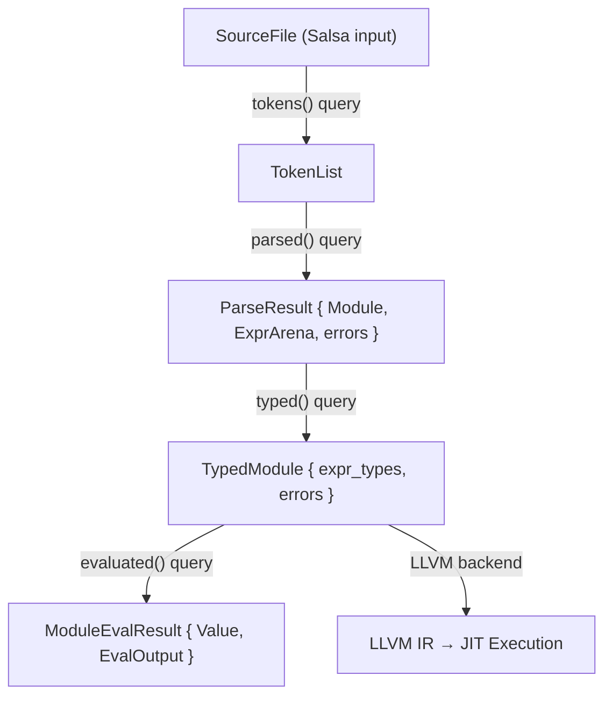

# Overview

This documentation describes the architecture and design decisions of the Ori compiler.

## Design Principle: Lean Core, Rich Libraries

The compiler implements only constructs that require **special syntax** or **static analysis**. Everything else belongs in the standard library.

| Location | What | Why |
|----------|------|-----|
| **Compiler** | `run`, `try`, `match`, `recurse`, `parallel`, `spawn`, `timeout`, `cache`, `with` | Require special syntax, bindings, `self()`, concurrency primitives, or capability checking |
| **Stdlib** | `map`, `filter`, `fold`, `find`, `retry`, `validate` | Standard method calls on collections; no special compiler support needed |

This keeps the compiler small (~30K lines), focused, and maintainable. The stdlib can evolve without compiler changes. When considering new features, ask: *"Does this need special syntax or static analysis?"* If no, it's a library function.

## Overview

The Ori compiler is a Rust-based incremental compiler built on the Salsa framework. It is organized as a **multi-crate workspace** with clear separation of concerns:

- **`ori_ir`** - Core IR types with no dependencies (AST, arena, interning, derives)
- **`ori_diagnostic`** - Error reporting system
- **`ori_lexer`** - Tokenization
- **`ori_types`** - Type system definitions
- **`ori_parse`** - Recursive descent parser
- **`ori_typeck`** - Type checking and inference
- **`ori_patterns`** - Pattern system, Value types, EvalError (single source of truth)
- **`ori_eval`** - Core evaluator components (Environment, operators)
- **`oric`** - CLI orchestrator, Salsa queries, evaluator, reporting

The compiler features:

- **Incremental compilation** via Salsa's automatic caching and dependency tracking
- **Flat AST representation** using arena allocation for memory efficiency
- **String interning** for O(1) identifier comparison
- **Extensible pattern system** with registry-based pattern definitions
- **Comprehensive diagnostics** with code fixes and multiple output formats

## Statistics

| Component | Lines of Code | Purpose |
|-----------|--------------|---------|
| IR | ~4,500 | AST types, arena, visitor, interning |
| Evaluator | ~5,500 | Tree-walking interpreter |
| Type System | ~4,300 | Type checking, inference, TypeContext |
| Parser | ~3,200 | Recursive descent parsing |
| Patterns | ~3,000 | Pattern system and builtins |
| Diagnostics | ~2,800 | Error reporting, DiagnosticQueue, fixes |
| Lexer | ~700 | DFA-based tokenization |
| Tests | ~1,100 | Test discovery, execution, error matching |
| **Total** | **~30,000** | |

## Compilation Pipeline

Each step is a Salsa query with automatic caching. If the input doesn't change, the cached output is returned immediately.

## Documentation Sections

### Architecture

- [Architecture Overview](01-architecture/index.md) - High-level compiler structure
- [Compilation Pipeline](01-architecture/pipeline.md) - Query-based pipeline design
- [Salsa Integration](01-architecture/salsa-integration.md) - Incremental compilation framework
- [Data Flow](01-architecture/data-flow.md) - How data moves through the compiler

### Intermediate Representation

- [IR Overview](02-intermediate-representation/index.md) - Data structures for compilation
- [Flat AST](02-intermediate-representation/flat-ast.md) - Arena-based expression storage
- [Arena Allocation](02-intermediate-representation/arena-allocation.md) - Memory management strategy
- [String Interning](02-intermediate-representation/string-interning.md) - Identifier deduplication
- [Type Representation](02-intermediate-representation/type-representation.md) - Runtime type encoding

### Lexer

- [Lexer Overview](03-lexer/index.md) - Tokenization design
- [Token Design](03-lexer/token-design.md) - Token types and structure

### Parser

- [Parser Overview](04-parser/index.md) - Parsing architecture
- [Recursive Descent](04-parser/recursive-descent.md) - Parsing approach
- [Error Recovery](04-parser/error-recovery.md) - Handling syntax errors
- [Grammar Modules](04-parser/grammar-modules.md) - Module organization

### Type System

- [Type System Overview](05-type-system/index.md) - Type checking architecture
- [Type Inference](05-type-system/type-inference.md) - Hindley-Milner inference
- [Unification](05-type-system/unification.md) - Type constraint solving
- [Type Environment](05-type-system/type-environment.md) - Scope-based type tracking
- [Type Registry](05-type-system/type-registry.md) - User-defined type storage

### Pattern System

- [Pattern System Overview](06-pattern-system/index.md) - Pattern architecture
- [Pattern Trait](06-pattern-system/pattern-trait.md) - PatternDefinition interface
- [Pattern Registry](06-pattern-system/pattern-registry.md) - Pattern lookup system
- [Pattern Fusion](06-pattern-system/pattern-fusion.md) - Optimization passes
- [Adding Patterns](06-pattern-system/adding-patterns.md) - How to add new patterns

### Evaluator

- [Evaluator Overview](07-evaluator/index.md) - Interpretation architecture
- [Tree Walking](07-evaluator/tree-walking.md) - Execution strategy
- [Environment](07-evaluator/environment.md) - Variable scoping
- [Value System](07-evaluator/value-system.md) - Runtime value representation
- [Module Loading](07-evaluator/module-loading.md) - Import resolution

### Diagnostics

- [Diagnostics Overview](08-diagnostics/index.md) - Error reporting system
- [Problem Types](08-diagnostics/problem-types.md) - Error categorization
- [Code Fixes](08-diagnostics/code-fixes.md) - Automatic fix suggestions
- [Emitters](08-diagnostics/emitters.md) - Output format handlers

### Testing

- [Testing Overview](09-testing/index.md) - Test system architecture
- [Test Discovery](09-testing/test-discovery.md) - Finding test functions
- [Test Runner](09-testing/test-runner.md) - Parallel test execution

### LLVM Backend

The LLVM backend (`ori_llvm` crate) provides JIT compilation and execution:

- **Architecture**: Follows Rust's `rustc_codegen_llvm` patterns
  - `SimpleCx` / `CodegenCx` context hierarchy
  - Separate `Builder` type for instruction generation
  - Two-phase codegen (declare then define)
  - Type caching for efficiency

- **Type Mappings**:
  - `int` → `i64`, `float` → `f64`, `bool` → `i1`
  - `str` → `{ i64 len, ptr data }`
  - `Option<T>` / `Result<T, E>` → `{ i8 tag, T payload }`
  - Lists → `{ i64 len, i64 cap, ptr data }`

- **Status**: JIT working (734/753 tests pass), AOT pending

### Appendices

- [Salsa Patterns](appendices/A-salsa-patterns.md) - Common Salsa usage patterns
- [Memory Management](appendices/B-memory-management.md) - Allocation strategies
- [Error Codes](appendices/C-error-codes.md) - Complete error code reference
- [Debugging](appendices/D-debugging.md) - Debug flags and tracing
- [Coding Guidelines](appendices/E-coding-guidelines.md) - Code style, testing, best practices

## Source Paths

The compiler is organized as a multi-crate workspace:

| Crate | Path | Purpose |
|-------|------|---------|
| `ori_ir` | `compiler/ori_ir/src/` | Core IR types (tokens, spans, AST, arena, interning, derives) |
| `ori_diagnostic` | `compiler/ori_diagnostic/src/` | DiagnosticQueue, error reporting, suggestions, emitters |
| `ori_lexer` | `compiler/ori_lexer/src/` | Tokenization via logos |
| `ori_types` | `compiler/ori_types/src/` | Type, TypeError, TypeContext, InferenceContext |
| `ori_parse` | `compiler/ori_parse/src/` | Recursive descent parser |
| `ori_typeck` | `compiler/ori_typeck/src/` | Type checking, inference, BuiltinMethodRegistry |
| `ori_patterns` | `compiler/ori_patterns/src/` | Pattern definitions, Value types, EvalError, EvalContext |
| `ori_eval` | `compiler/ori_eval/src/` | Environment, OperatorRegistry (core eval components) |
| `ori_llvm` | `compiler/ori_llvm/src/` | LLVM backend for JIT/AOT compilation (requires Docker) |
| `ori-macros` | `compiler/ori-macros/src/` | Diagnostic derive macros |
| `oric` | `compiler/oric/src/` | CLI, Salsa queries, eval orchestration, reporting |

**Note:** `oric` modules (`ir`, `parser`, `diagnostic`, `types`) re-export from source crates for DRY.

### oric Internal Paths

| Component | Path |
|-----------|------|
| Library root | `compiler/oric/src/lib.rs` |
| Salsa database | `compiler/oric/src/db.rs` |
| Query system | `compiler/oric/src/query/` |
| Evaluator | `compiler/oric/src/eval/` |
| Problem types | `compiler/oric/src/problem/` |
| Diagnostic rendering | `compiler/oric/src/reporting/` |
| Tests | `compiler/oric/src/test/` |

### Architecture Notes

- **Patterns**: Pattern definitions and Value types are in `ori_patterns`. oric re-exports from this crate.
- **Environment**: The `Environment` type for variable scoping is in `ori_eval`. oric uses this directly.
- **Re-exports**: oric modules (`ir`, `types`, `diagnostic`) re-export from their source crates for DRY.
