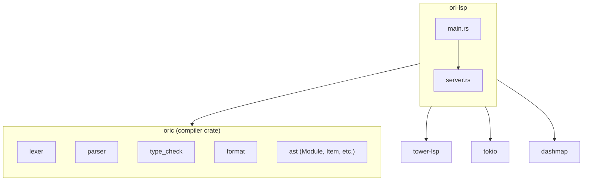

# Architecture Overview

> **Note**: The crate is located at `tools/ori-lsp/`, not `compiler/ori_lsp/`.

The LSP server uses `tower-lsp` for async protocol handling with `DashMap` for concurrent document storage.

## Crate Structure

```
tools/ori-lsp/
├── Cargo.toml
└── src/
    ├── main.rs             # Entry point, Tokio runtime
    └── server.rs           # OriLanguageServer implementation
                            # - Document storage (DashMap)
                            # - Diagnostics publishing
                            # - Hover, definition, completion handlers
                            # - Formatting via ori_fmt
```

## Dependency Graph



The LSP depends on `oric` which provides all compiler functionality through a unified interface.

## Core Types

### OriLanguageServer

The server struct holds the LSP client and document storage:

```rust
pub struct OriLanguageServer {
    /// Client for sending notifications (diagnostics, etc.)
    client: Client,

    /// Concurrent document storage
    documents: DashMap<Url, Document>,
}
```

### Document

Each open document stores its text and cached analysis:

```rust
pub struct Document {
    /// Full document text
    pub text: String,

    /// Cached parsed module (if successful)
    pub module: Option<Module>,

    /// Current diagnostics for this document
    pub diagnostics: Vec<Diagnostic>,
}
```

### LanguageServer Trait Implementation

tower-lsp provides the `LanguageServer` trait for handling LSP methods:

```rust
#[tower_lsp::async_trait]
impl LanguageServer for OriLanguageServer {
    async fn initialize(&self, _: InitializeParams) -> Result<InitializeResult> {
        Ok(InitializeResult {
            capabilities: ServerCapabilities {
                text_document_sync: Some(TextDocumentSyncCapability::Kind(
                    TextDocumentSyncKind::FULL,
                )),
                hover_provider: Some(HoverProviderCapability::Simple(true)),
                definition_provider: Some(OneOf::Left(true)),
                completion_provider: Some(CompletionOptions {
                    trigger_characters: Some(vec![".".to_string(), "@".to_string(), "$".to_string()]),
                    ..Default::default()
                }),
                document_formatting_provider: Some(OneOf::Left(true)),
                ..Default::default()
            },
            server_info: Some(ServerInfo {
                name: "ori-lsp".to_string(),
                version: Some(env!("CARGO_PKG_VERSION").to_string()),
            }),
        })
    }

    async fn hover(&self, params: HoverParams) -> Result<Option<Hover>> {
        let uri = params.text_document_position_params.text_document.uri;
        let position = params.text_document_position_params.position;
        Ok(self.get_hover_info(&uri, position))
    }

    // ... other handlers
}
```

### Document Lifecycle

Documents are tracked through open/change/close notifications:

```rust
async fn did_open(&self, params: DidOpenTextDocumentParams) {
    let uri = params.text_document.uri;
    let text = params.text_document.text;

    // Parse and type check
    let (module, diagnostics) = self.parse_document(&uri, &text).await;

    // Store in DashMap
    self.documents.insert(uri.clone(), Document { text, module, diagnostics: diagnostics.clone() });

    // Publish diagnostics to client
    self.publish_diagnostics(uri, diagnostics).await;
}

async fn did_change(&self, params: DidChangeTextDocumentParams) {
    let uri = params.text_document.uri;
    let text = params.content_changes.into_iter().next()
        .map(|c| c.text).unwrap_or_default();

    // Re-parse and update
    let (module, diagnostics) = self.parse_document(&uri, &text).await;
    self.documents.insert(uri.clone(), Document { text, module, diagnostics: diagnostics.clone() });
    self.publish_diagnostics(uri, diagnostics).await;
}
```

### Future Enhancement: FileSystemProxy

The FileSystemProxy pattern (used by Gleam) would provide a transparent cache for unsaved editor content across files. This is **not yet implemented** but planned for multi-file analysis support.

### Future Enhancement: DiagnosticTracker

The DiagnosticTracker pattern (used by Gleam) tracks which files have diagnostics for incremental updates. This is **not yet implemented** but planned for efficient cross-file diagnostic publishing.

## Cargo Configuration

```toml
[package]
name = "ori-lsp"
version.workspace = true
edition.workspace = true

[[bin]]
name = "ori-lsp"
path = "src/main.rs"

[dependencies]
# Compiler orchestration (provides lexer, parser, type_check, format)
oric = { path = "../../compiler/oric" }

# LSP framework
tower-lsp = "0.20"
tokio = { version = "1", features = ["full"] }

# Concurrent document storage
dashmap = "5"

# Serialization
serde = { version = "1", features = ["derive"] }
serde_json = "1"
```

**Why `tower-lsp`**:
- Native async/await with Tokio runtime
- Built-in concurrent request handling
- Simpler trait-based handler implementation
- Well-maintained and widely used

## Main Loop Architecture

The server uses tower-lsp's async architecture with Tokio:

```rust
// main.rs - Entry point
#[tokio::main]
async fn main() {
    let stdin = tokio::io::stdin();
    let stdout = tokio::io::stdout();

    let (service, socket) = LspService::new(OriLanguageServer::new);
    Server::new(stdin, stdout, socket).serve(service).await;
}
```

tower-lsp handles:
- Protocol message parsing
- Request/response correlation
- Concurrent request handling
- Lifecycle management (initialize, shutdown)

### Server Construction

```rust
impl OriLanguageServer {
    pub fn new(client: Client) -> Self {
        OriLanguageServer {
            client,
            documents: DashMap::new(),
        }
    }
}
```

### Document Analysis Pipeline

```rust
/// Parse a document and return diagnostics
async fn parse_document(&self, uri: &Url, text: &str) -> (Option<Module>, Vec<Diagnostic>) {
    let filename = uri.path();
    let mut diagnostics = Vec::new();

    // Lexer phase
    let tokens = match lexer::tokenize(text, filename) {
        Ok(t) => t,
        Err(e) => {
            diagnostics.push(to_lsp_diagnostic("Lexer error", &e, "E1000"));
            return (None, diagnostics);
        }
    };

    // Parser phase
    let mut parser = parser::Parser::new(tokens);
    let module = match parser.parse_module(filename) {
        Ok(m) => m,
        Err(e) => {
            diagnostics.push(to_lsp_diagnostic("Parse error", &e, "E2000"));
            return (None, diagnostics);
        }
    };

    // Type checking phase
    match oric::type_check(module.clone()) {
        Ok(_) => {}
        Err(diag) => {
            diagnostics.push(diagnostic_to_lsp(&diag, text));
        }
    }

    (Some(module), diagnostics)
}
```

## Future: WASM Compilation

WASM compilation for browser playground is **not yet implemented**. When implemented, it would provide:

- Direct method calls (no message passing)
- In-memory file system
- Integration with Monaco editor

See `02-architecture/wasm.md` for the planned design.

## Error Handling

tower-lsp uses `Result<T, jsonrpc::Error>` for request handlers. Internal errors are logged via the client:

```rust
async fn hover(&self, params: HoverParams) -> Result<Option<Hover>> {
    let uri = params.text_document_position_params.text_document.uri;
    let position = params.text_document_position_params.position;
    Ok(self.get_hover_info(&uri, position))
}
```

Diagnostic errors are published to the client, not returned from handlers:

```rust
async fn publish_diagnostics(&self, uri: Url, diagnostics: Vec<Diagnostic>) {
    self.client
        .publish_diagnostics(uri, diagnostics, None)
        .await;
}
```

## Testing Strategy

### Unit Tests

Test features in isolation:

```rust
#[cfg(test)]
mod tests {
    use super::*;

    #[test]
    fn test_hover_on_function() {
        let code = "@add (a: int, b: int) -> int = a + b";
        let module = parse_for_test(code);

        let info = hover_for_item(&module.items[0], 1); // cursor on 'add'

        assert!(info.unwrap().contains("@add"));
    }

    #[test]
    fn test_diagnostics_parse_error() {
        let code = "let x = ";
        let (_, diagnostics) = parse_document_for_test(code);

        assert_eq!(diagnostics.len(), 1);
        assert_eq!(diagnostics[0].severity, Some(DiagnosticSeverity::ERROR));
    }
}
```

### Integration Tests

Test full request/response cycle with tokio test runtime:

```rust
#[tokio::test]
async fn test_format_request() {
    let (service, _socket) = LspService::new(OriLanguageServer::new);

    // Simulate document open and format request
    // ...
}
```
