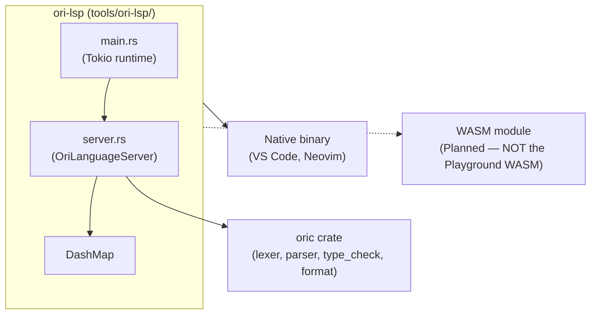

# Overview

> **Implementation Status**: This document describes the LSP design roadmap. The current implementation is a minimal MVP — see individual feature docs for actual implementation status.

This documentation describes the design and implementation of the Ori Language Server (`ori_lsp`). The language server provides IDE features via the Language Server Protocol (LSP).

## Implementation Status

The LSP server is implemented at `tools/ori-lsp/` using:
- **`tower-lsp`** crate for async LSP protocol implementation
- **`DashMap`** for concurrent document storage
- **`tokio`** for async runtime

**Current Features:**
- ✅ Diagnostics (lex, parse, and type errors via `oric::type_check()`)
- ✅ Go to Definition (`textDocument/definition`)
- ⚠️ Partial — Hover (function signatures and type definitions only)
- ⚠️ Partial — Completions (keywords, snippets, and functions from current document)
- ✅ Formatting (full document formatting via `ori_fmt`)

**Not Yet Implemented:**
- ⚠ WASM compilation for browser playground (the Playground currently uses a separate runtime WASM module at `website/playground-wasm/`, not the LSP server compiled to WASM)
- ⚠ Find References
- ⚠ Document Symbols
- ⚠ Code Actions
- ⚠ Semantic Tokens

## Goals

1. **Single implementation, multiple clients** — One LSP server serves VS Code, Neovim, and any LSP-compatible editor
2. **Integrated** — Leverages existing compiler infrastructure (`ori_fmt`, `ori_typeck`, etc.)
3. **Incremental** — Start with essential features, expand over time

## Reference Implementations

The Ori LSP design draws from established language server implementations:

| Language | Key Patterns Adopted |
|----------|---------------------|
| **Gleam** | FileSystemProxy, Response pattern |
| **rust-analyzer** | Snapshot pattern, single main loop with `select!`, execution mode dispatch |
| **Go (gopls)** | Structured diagnostics with SuggestedFix, modular analyzer design |

### Why These References

- **Gleam**: Rust-based, similar scale, clean separation of LSP from compiler
- **rust-analyzer**: Production-grade patterns for threading and cancellation
- **Go**: Pioneered structured diagnostics with machine-applicable fixes

## Architecture



## Feature Roadmap

### Phase 1: Foundation

| Feature | LSP Method | Priority | Status |
|---------|------------|----------|--------|
| Formatting | `textDocument/formatting` | P0 | ✅ Implemented |
| Diagnostics | `textDocument/publishDiagnostics` | P0 | ✅ Implemented (lex, parse, type errors) |
| Hover | `textDocument/hover` | P0 | ⚠️ Partial |
| Go to Definition | `textDocument/definition` | P0 | ✅ Implemented |
| Completions | `textDocument/completion` | P0 | ⚠️ Partial (keywords, snippets, document functions) |

### Phase 2: Navigation

| Feature | LSP Method | Priority |
|---------|------------|----------|
| Find References | `textDocument/references` | P1 |
| Document Symbols | `textDocument/documentSymbol` | P1 |

### Phase 3: Editing

| Feature | LSP Method | Priority |
|---------|------------|----------|
| Completion | `textDocument/completion` | P2 |
| Signature Help | `textDocument/signatureHelp` | P2 |
| Rename | `textDocument/rename` | P2 |

### Phase 4: Advanced

| Feature | LSP Method | Priority |
|---------|------------|----------|
| Code Actions | `textDocument/codeAction` | P3 |
| Inlay Hints | `textDocument/inlayHint` | P3 |
| Semantic Tokens | `textDocument/semanticTokens` | P3 |

## Documentation Sections

### Protocol

- [Protocol Overview](01-protocol/index.md) — LSP methods and lifecycle
- [Document Sync](01-protocol/document-sync.md) — Text synchronization strategy

### Architecture

- [Architecture Overview](02-architecture/index.md) — Crate structure and dependencies
- [WASM Compilation](02-architecture/wasm.md) — Browser deployment

### Features

- [Features Overview](03-features/index.md) — Feature implementations
- [Diagnostics](03-features/diagnostics.md) — Error and warning reporting
- [Hover](03-features/hover.md) — Type information display
- [Formatting](03-features/formatting.md) — Code formatting integration

### Integration

- [Integration Overview](04-integration/index.md) — Client integration
- [Playground](04-integration/playground.md) — Browser-based Monaco integration
- [Editors](04-integration/editors.md) — VS Code, Neovim configuration

## Crate Location

```
tools/ori-lsp/
├── Cargo.toml
└── src/
    ├── main.rs          # Entry point with Tokio runtime
    └── server.rs        # OriLanguageServer implementation
```

## Dependencies

### Compiler Crates

| Crate | Purpose |
|-------|---------|
| `oric` | Compiler orchestration, type checking, formatting |
| `ori_ir` | AST and spans |

### LSP Infrastructure

| Crate | Purpose |
|-------|---------|
| `tower-lsp` | Async LSP protocol implementation |
| `tokio` | Async runtime |
| `dashmap` | Concurrent HashMap for document storage |
| `lsp-types` | (via tower-lsp) LSP protocol type definitions |

### Architecture Choice

We use `tower-lsp` for:
- Async/await patterns with Tokio
- Built-in concurrent request handling
- Simpler trait-based handler implementation

## Design Principles

1. **Leverage existing infrastructure** — Use `ori_fmt` for formatting, `ori_typeck` for type info
2. **Async with tower-lsp** — Concurrent request handling via Tokio
3. **DashMap for documents** — Thread-safe concurrent document storage
4. **Full document sync** — Simple full-text sync (incremental sync planned)
5. **Fast feedback** — Prioritize responsiveness over completeness
6. **Graceful degradation** — Partial results better than failure

## Current Architecture

### Document Storage

Documents are stored in a concurrent `DashMap`:

```rust
pub struct OriLanguageServer {
    client: Client,
    documents: DashMap<Url, Document>,
}

pub struct Document {
    pub text: String,
    pub module: Option<Module>,
    pub diagnostics: Vec<Diagnostic>,
}
```

### Request Handling

tower-lsp handles concurrent requests automatically:

```rust
#[tower_lsp::async_trait]
impl LanguageServer for OriLanguageServer {
    async fn hover(&self, params: HoverParams) -> Result<Option<Hover>> {
        // Access documents via DashMap
        let doc = self.documents.get(&uri)?;
        // ...
    }
}
```

### Future Enhancements

**Not Yet Implemented:**
- FileSystemProxy pattern (for unsaved edits across files)
- Snapshot pattern (for parallel analysis)
- Structured diagnostics with SuggestedFix
- Incremental document sync
