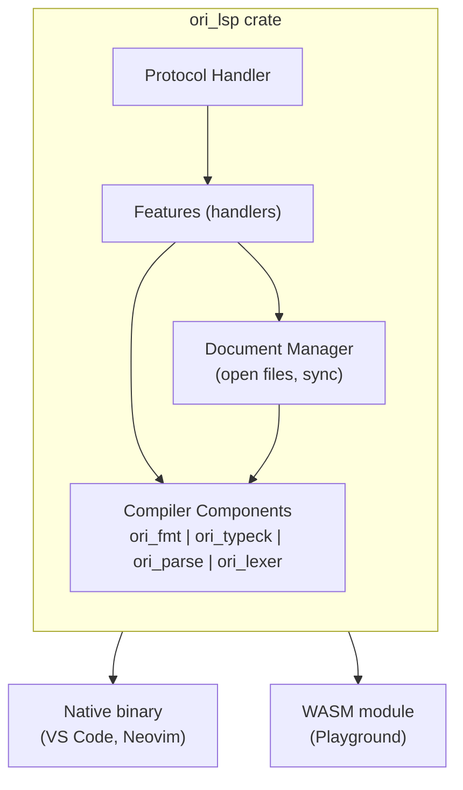

> **Proposed** — This design has not yet been implemented.

# Overview

This documentation describes the design and implementation of the Ori Language Server (`ori_lsp`). The language server provides IDE features via the Language Server Protocol (LSP).

## Goals

1. **Single implementation, multiple clients** — One LSP server serves VS Code, Neovim, Playground, and any LSP-compatible editor
2. **WASM-first** — Compiles to WebAssembly for in-browser Playground use
3. **Incremental** — Start with essential features, expand over time
4. **Integrated** — Leverages existing compiler infrastructure (`ori_fmt`, `ori_typeck`, etc.)

## Reference Implementations

The Ori LSP design draws from established language server implementations:

| Language | Key Patterns Adopted |
|----------|---------------------|
| **Gleam** | FileSystemProxy, Response pattern, `lsp-server`/`lsp-types` crates |
| **rust-analyzer** | Snapshot pattern, single main loop with `select!`, execution mode dispatch |
| **Go (gopls)** | Structured diagnostics with SuggestedFix, modular analyzer design |

### Why These References

- **Gleam**: Rust-based, similar scale, clean separation of LSP from compiler
- **rust-analyzer**: Production-grade patterns for threading and cancellation
- **Go**: Pioneered structured diagnostics with machine-applicable fixes

## Architecture



## Feature Roadmap

### Phase 1: Foundation

| Feature | LSP Method | Priority |
|---------|------------|----------|
| Formatting | `textDocument/formatting` | P0 |
| Diagnostics | `textDocument/publishDiagnostics` | P0 |
| Hover | `textDocument/hover` | P0 |

### Phase 2: Navigation

| Feature | LSP Method | Priority |
|---------|------------|----------|
| Go to Definition | `textDocument/definition` | P1 |
| Find References | `textDocument/references` | P1 |
| Document Symbols | `textDocument/documentSymbol` | P1 |

### Phase 3: Editing

| Feature | LSP Method | Priority |
|---------|------------|----------|
| Completion | `textDocument/completion` | P2 |
| Signature Help | `textDocument/signatureHelp` | P2 |
| Rename | `textDocument/rename` | P2 |

### Phase 4: Advanced

| Feature | LSP Method | Priority |
|---------|------------|----------|
| Code Actions | `textDocument/codeAction` | P3 |
| Inlay Hints | `textDocument/inlayHint` | P3 |
| Semantic Tokens | `textDocument/semanticTokens` | P3 |

## Documentation Sections

### Protocol

- [Protocol Overview](01-protocol/index.md) — LSP methods and lifecycle
- [Document Sync](01-protocol/document-sync.md) — Text synchronization strategy

### Architecture

- [Architecture Overview](02-architecture/index.md) — Crate structure and dependencies
- [WASM Compilation](02-architecture/wasm.md) — Browser deployment

### Features

- [Features Overview](03-features/index.md) — Feature implementations
- [Diagnostics](03-features/diagnostics.md) — Error and warning reporting
- [Hover](03-features/hover.md) — Type information display
- [Formatting](03-features/formatting.md) — Code formatting integration

### Integration

- [Integration Overview](04-integration/index.md) — Client integration
- [Playground](04-integration/playground.md) — Browser-based Monaco integration
- [Editors](04-integration/editors.md) — VS Code, Neovim configuration

## Crate Location

```
compiler/ori_lsp/
├── Cargo.toml
├── src/
│   ├── lib.rs           # Core LSP logic (shared native/WASM)
│   ├── main.rs          # Native binary entry point
│   ├── protocol/        # LSP message handling
│   ├── features/        # Feature implementations
│   └── document.rs      # Document state management
```

## Dependencies

### Compiler Crates

| Crate | Purpose |
|-------|---------|
| `ori_fmt` | Code formatting |
| `ori_typeck` | Type checking, type info for hover |
| `ori_parse` | Parsing for diagnostics |
| `ori_lexer` | Tokenization |
| `ori_ir` | AST and spans |

### LSP Infrastructure (Native)

| Crate | Purpose |
|-------|---------|
| `lsp-server` | Generic LSP transport (stdio), message loop — used by Gleam, rust-analyzer |
| `lsp-types` | LSP protocol type definitions |
| `crossbeam-channel` | Channel-based main loop (rust-analyzer pattern) |
| `serde_json` | JSON serialization for LSP messages |

### WASM (Browser)

| Crate | Purpose |
|-------|---------|
| `wasm-bindgen` | WASM bindings |
| `serde_json` | JSON serialization |

**Note**: We use `lsp-server` instead of `tower-lsp` because:
- `lsp-server` is simpler (no async runtime required)
- Used by both Gleam and rust-analyzer
- Easier to reason about with single-threaded main loop

## Design Principles

1. **Leverage existing infrastructure** — Use `ori_fmt` for formatting, `ori_typeck` for type info
2. **Single-threaded main loop** — Simpler than async, use worker threads for heavy work (rust-analyzer)
3. **Snapshot pattern** — Immutable state clones for thread-safe worker access (rust-analyzer)
4. **FileSystemProxy** — Transparent in-memory cache for unsaved edits (Gleam)
5. **Structured diagnostics** — Include `SuggestedFix` with `TextEdit[]` from day one (Go)
6. **Fast feedback** — Prioritize responsiveness over completeness
7. **Graceful degradation** — Partial results better than failure

## Key Patterns

### FileSystemProxy (from Gleam)

In-memory cache for unsaved editor content, transparent to compiler:

```rust
struct FileSystemProxy {
    disk: RealFileSystem,
    memory: HashMap<Url, String>,  // Unsaved edits
}

impl FileSystemProxy {
    fn read(&self, uri: &Url) -> Option<String> {
        // Check memory first, fall back to disk
        self.memory.get(uri).cloned()
            .or_else(|| self.disk.read(uri))
    }
}
```

### Snapshot Pattern (from rust-analyzer)

Immutable state clones for thread-safe parallel work:

```rust
struct GlobalState {
    documents: DocumentManager,
    // ... mutable state
}

impl GlobalState {
    fn snapshot(&self) -> GlobalStateSnapshot {
        GlobalStateSnapshot {
            documents: self.documents.clone(),
            // ... immutable clone
        }
    }
}

// Workers receive snapshot, main thread keeps mutable state
```

### Response Pattern (from Gleam)

Bundle result with metadata for intelligent feedback:

```rust
struct Response<T> {
    result: Result<T, Error>,
    warnings: Vec<Warning>,
    compiled_files: Vec<Url>,  // For incremental diagnostics
}
```
